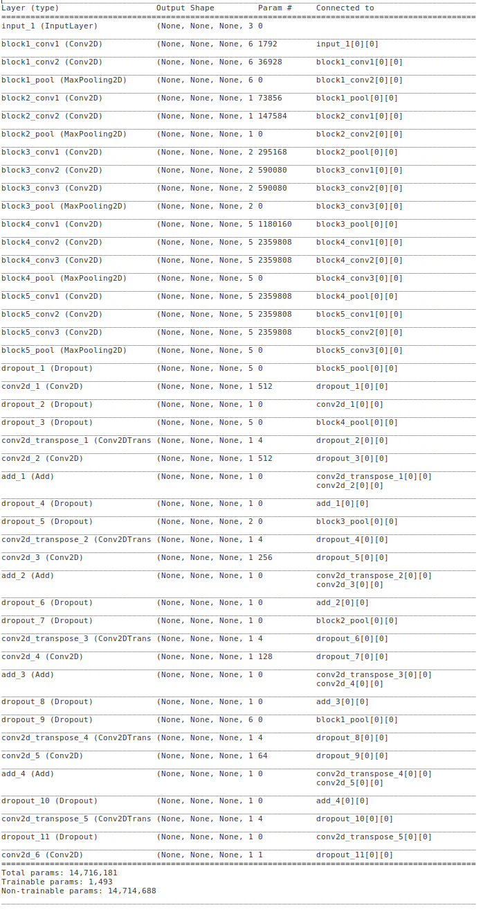

# Pet Image Segmentation in Keras

This is a skip-layer semantic model built in Keras based on pre-trained VGG16 
with final training on pet images.  A real nice data set to train with is the 
Oxford-IIIT pet data set.  Drop the data set into the `/data` directory and 
look in the code to see how it loads it.

### Mechanism of operation

Start with the stock VGG16 trained on ImageNet, excluding the fully connected 
top end since we are not solving a classification problem.  This has a summary 
like this:

Next create transpose convolution layers through the network added together to 
reinforce features at different scales.  This results in a summary like this:

The idea is to freeze the weights of the pre-trained VGG16 convolutional layers 
and only train the new transpose convolution layers.  This yields a model with
a relatively small number of trainable parameters that are all near the top
of the model and consequently quicker to train.  You can make a lot of adjustments
to the capability of the model by altering the particulars of the convolution
layers and transpose convolution layers, which will affect the number of trainable
parameters and the characteristics of the features that will result in the
trained segmentation.  

You might note that there are a lot of segmentation models based around this 
general encoder-decoder-ish concept.  The difference tends to be what exactly
you are doing with the transpose convolution layers.  For example, in this
case with the skip-layer model, we are simply summing the various scales to
achieve a result that reinforces regions at any scale that cummulatively have
the features we are looking for.  Constrast this with something like U-Net that
superficially looks very similar, but is actually concatenating the outputs
of the transpose convolution layers.  The U-Net approach results in significantly
more trainable parameters with a different dynamic with regard to how it 
segments the image.

One thing that is critical is to use a good metric for loss so that the model 
trains well.  This can be accomplished several ways. It is actually possible 
to flatten your output layer and use a variety of stock metrics on the resulting
vector.  This can work surprisingly well, but it isn't really as good as a
metric that is specific to the objective we are trying to achieve.  What we
really want to know is how well our segmentation compares with the known
segmentation.  One metric that does this well is intersection of union.  The
trouble with intersection over union is that it is expensive to compute.  Think
about it - for an image of size 224x224, the intersection is the number of 
points where both the output and label indicate the same truth, while the
union is where either indicate truth.  That is quite a lot of computation that
in general does not have a good vectorized implementation.  The so-called dice 
metric is often used and offers better performance while achieving much of the
same general goal.  The benefit is that the dice metric is able to be 
implemented with vectorized code easily.

Some papers on the topic of segmentation in general might be:
  
  * [Learning to Segment Every Thing](https://arxiv.org/pdf/1711.10370.pdf)

Some similar concept reference implementations might be:

  * [Deep Learning Tutorial for Kaggle Ultrasound Nerve Segmentation competition, using Keras](https://github.com/jocicmarko/ultrasound-nerve-segmentation)

  * [Kaggle ultrasound nerve segmentation challenge using Keras](https://github.com/raghakot/ultrasound-nerve-segmentation)

  * [NNProject - DeepMask](https://github.com/abbypa/NNProject_DeepMask)

  * [Image Segmentation Keras: Implementation of Segnet, FCN, UNet and other models in Keras](https://github.com/divamgupta/image-segmentation-keras)

Some papers regarding different choices for loss function might be:

  * [Generalised Dice overlap as a deep learning loss function for highly unbalanced segmentations](https://arxiv.org/pdf/1707.03237.pdf)

### Code

There is a controller, `main.py`, that uses the classes in `/src`.  The
way it is broken up should be pretty obvious and reasonably easy to extend
should you want to use some other data set.  

